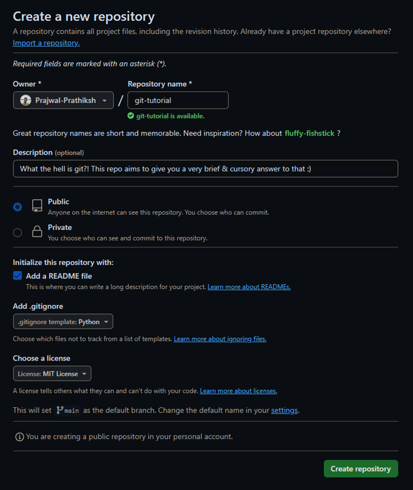
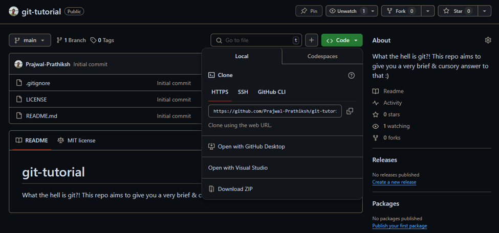
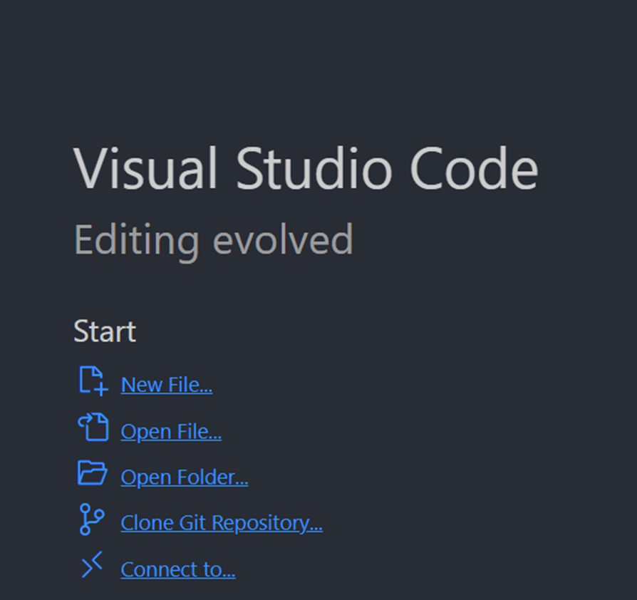

# **The Heck Is That? :thinking:**

> <span style="color:#80d9f3">  *Expect only the most midwitted answers :)* </span>

---
# It's a version control system!


* **The heck is that now!**
* <span style="color:#80d9f3">Put simply: *It's a time-machine for your code!*</span>
* **Okay now give me a real answer!**
* <span style="color:#80d9f3">Hmmmmmm$........$</span>

---
# Okay here's the real answer


- *Git is a <span style="color:yellow">distributed</span> <span style="color:orange">version control system</span>*
> <span style="color:yellow">Distributed</span> $\Rightarrow$ Everyone has a full copy of the repo
> <span style="color:orange">Version control system</span> $\Rightarrow$ Keeps track of changes in code

---
# <!--fit--> Why should I care?

---
# Part 1: I wanna go back in time

* Damn I think I broke something by adding some code$...$
  * **No problem!** Just `revert` back to the last working version
  
* `git revert HEAD` $\Rightarrow$ Revert to the last commit
* `git revert HEAD~2` $\Rightarrow$ Revert two commits back
* `git diff HEAD HEAD~2` $\Rightarrow$ See the changes between the last two commits

---
# Part 2: I wanna try something new

* I want to experiment with some new features but don't want to mess up the main code$...$
  * **No problem!** Just create a new `branch` and work on that

* `git branch feat-new` $\Rightarrow$ Create a new branch called `feat-new`
* `git checkout feat-new` $\Rightarrow$ Switch to the `feat-new` branch
* `git checkout main` $\Rightarrow$ Switch back to the main branch
* `git merge feat-new` $\Rightarrow$ Merge `feat-new` branch into `main`

---
# Part 3, 4, 5 $...$ and so on

* I see this cool project, but I want to some changes of my own$...$
  * Just `fork` the repo and make your changes
* I want to let my friends work on my project$...$
  * Just `clone` the repo and work on it
* I want to sync my project with the latest changes$...$
  * Just `pull` and `push` your changes to the repo *$...$ and so on*

> *The possibilities, despite being endless, are quite simply, beyond the scope of this simple tutorial 😞*

---
# Part $\infty :$ Gimme some of that CI/CD magic :sparkles:

<span style="color:#80d9f3">*Fill in the blanks:*</span>
**I want to _______________ every time I make a change**

- $...$ run some tests $...$
> Makes sure you don't break anything in the first place!

- $...$ run some linters $...$
> **[Linters?](https://en.wikipedia.org/wiki/Lint_(software))** They're like your code's personal grammar, spell, and style checker!

- $...$ publish code documentation $...$
- $...$ deploy my code to a server $...$ and so on


Welcome to the world of **Continuous Integration and Continuous Deployment!**

---
# <!--fit--> How do I get started?

- RTFM!
  - *Read the "friendly" manual of course :wink: [Git Documentation](https://git-scm.com/doc)*

---
# Aha! Now that you're interested$...$

- **Step 1:** Install Git, duh! ([Download Git](https://git-scm.com/downloads))
- **Step 2:** Set up your Git with your credentials on `git bash` and run the following commands:

```shell
git config --global user.name "Your Name"
git config --global user.email "your.name@email.com
```
> **Note:** The above step must mandatorily be done from the terminal 😱, but fortunately only once!

- **Step 3:** Create a new repository on GitHub
- **Step 4:** Clone the repository to your local machine

```shell
git clone https://your-repo-url
```

---
# <!--fit--> "I ain't using no terminal!"

> **No problem!** There are plenty of GUI clients or IDEs that support Git, VSCode being one of them!
>> But the terminal is where the real magic happens! :sparkles:

---
# Create a new repository


---
# Get the repository URL for cloning


---
# Clone the repository using Visual Studio Code


---
# Install some extensions
> (For quality of life improvements of course!)

<div class="columns">
  <div>

  *General extensions*
  1. `Material Icon Theme` - For pretty icons in file tree
  2. `IntelliCode` - For AI-assisted code completion
  3. `GitLens` - For seeing who changed what and when
  4. `GitHub Pull Requests` - For managing pull requests
  </div>
  <div>
   
   *Python specific extensions*
   1. `Python`, `Pylance`, `Python Debugger` - For Python language support
   2. `Jupyter` - For Jupyter notebook support
   3. `isort` - For sorting imports
   4. `Black` - For formatting code
  </div>
</div>

---
# <!--fit--> And that's it!